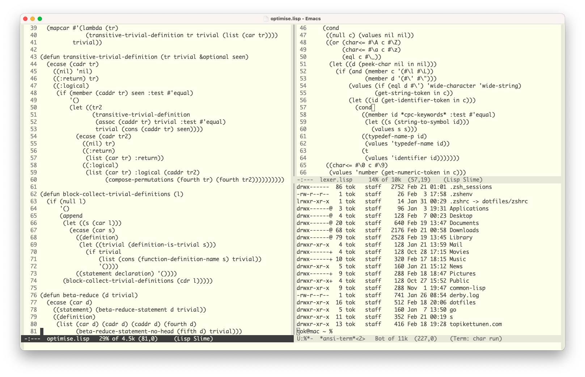

## About



After a long stint of using syntax highlighting in my editors, I've decided to
part ways with it. This decision might not work for everyone, but I've been
happy with this decision. I don't say that syntax highlighting is necessarily
bad, but I believe that lousy syntax highlighting is arguably worse than nothing
at all, which is the big reason why I started to work on this theme. 

The main principle idea behind this theme is to look at these colours for a long
time. The yellowish background here is heavily influenced by the colour choices
of [Plan 9's acme editor](http://acme.cat-v.org/), and the dark greyish font
colour is used mainly for the fact that it's a little bit easier on the eyes
compared to just black. Otherwise, I wanted to remove most of the colours from
my theme, but I made it so that comments show in different colours compared to
the foreground's standard colour. 

Why did I decide to leave syntax highlighting? I value code readability a lot
when I'm working with different programs. Code readability is hugely dependant
on the programmer itself, but I don't want my colour choices to make any code
piece lesser readable. I noticed that with syntax highlighting set on, I often
tend to shift focus on wrong places in the code. When I removed all the
colourings from my editors, I realized that I could better understand the whole
code structure much faster. This is something that won't necessarily work for
everyone, but it worked for me.

Another realization that I made was the fact the cognitive overhead when
switching between languages was much smaller. I tend to work with a wide variety
of different languages professionally and in personal projects, so switching
from language to language can be quite hard. I quickly noticed that without
syntax highlighting, the switch between languages started to seem much more
effortless.

Does this work the same for everyone? Probably not, but you feel free to test my
theme, and I would gladly hear your thoughts about it. 


## Installation

### MELPA

``` elisp
(use-package brutal-theme
  :config
  (load-theme 'brutal t))
```

### Local

You can also install this theme by copying it to your `.emacs.d`. I use `themes`
directory for holding this so I can load it with: 

``` elisp
(add-to-list 'custom-theme-load-path "~/.emacs.d/themes")
(load-theme 'brutal t)
```

Or with `use-package`:

``` elisp
(use-package brutal-theme
  :load-path "themes"
  :config
  (load-theme 'brutal t))
```

## Contributing

I like to keep my own `.emacs.d` relatively clean so there might be some "ugly"
coloring in some of the modes, since I have most likely just missed that because
I don't use it. If you happen to find some of these, feel free to drop a PR to clean
it.
